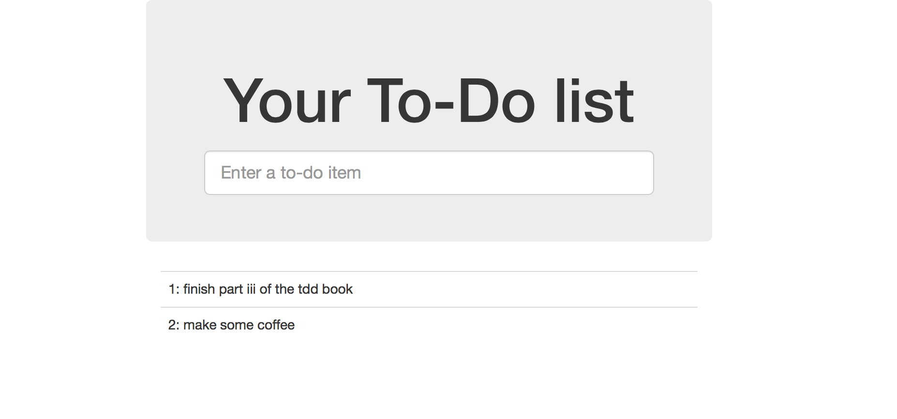

# Follow the Testing Goat
This project helps me to follow [Test-Driven Development With Python nook by hilarious Harry J.W.Percival](http://www.obeythetestinggoat.com/). It's a really fun read. You can find the book [here](http://shop.oreilly.com/product/0636920029533.do).

The website is running at <pdyban.ddns.net>: my personal [nginx](http://nginx.org/en) web server at home powered by [generation 1 Raspberry Pi](https://www.raspberrypi.org/products/model-b/) under the dinner table.

